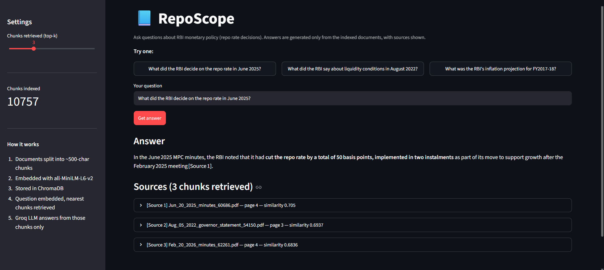

# 📘 RepoScope

A retrieval-augmented question answering system over Reserve Bank of India monetary policy documents. Ask a question in plain English about the repo rate, inflation projections or policy stance, and RepoScope retrieves the relevant passages from the actual RBI documents and generates a grounded answer with sources cited.

Built to avoid the core failure mode of using an LLM on domain documents: confident answers that aren't in the source material. Every answer is constrained to retrieved context, and retrieval quality is measured rather than assumed.



## Pipeline
RBI documents → chunking (~500 chars, 50 overlap) → all-MiniLM-L6-v2 embeddings
→ ChromaDB vector store → semantic search (top-k) → Groq LLM → cited answer


## Data

| | |
|---|---|
| Source documents | 163 (MPC Resolutions, Minutes, Governor's Statements, 2016–2026) |
| Pages loaded | 1,420 |
| Chunks indexed | 10,757 |
| Embedding model | all-MiniLM-L6-v2 (384-dim) |
| Vector store | ChromaDB (cosine similarity) |
| LLM | openai/gpt-oss-120b via Groq |

## Retrieval evaluation

Retrieval is evaluated on 15 hand-labelled questions. For each question the correct source document is known in advance; a retrieval counts as a hit if that document appears among the top-k chunks.

| Metric | Result |
|---|---|
| Recall@1 | 13.3% |
| Recall@3 | 20.0% |
| Recall@5 | 40.0% |

**A known limitation, diagnosed and partially fixed:** many RBI documents (e.g. successive years' April policy resolutions) share near-identical procedural language, differing mainly by date. Pure semantic embedding struggled to disambiguate these — a question like "What did the MPC decide in the April 2021 resolution?" could retrieve the April 2019 or 2023 equivalent, since the *meaning* of the sentences is nearly identical across years. Prepending each document's filename-derived date/type as a text prefix before chunking (rather than leaving it only in metadata) doubled Recall@5 from 20% to 40%, confirming the fix helps but doesn't fully resolve ranking on these boilerplate-heavy documents — a natural next step would be hybrid search (combining keyword/date filtering with semantic search).

Per-question results are in `evaluation/results.csv`.

## Project structure
RepoScope/
├── data/raw/ RBI source documents (PDFs)
├── src/
│ ├── config.py paths, models, chunking params
│ ├── loader.py document loading and chunking
│ ├── embeddings.py embedding generation
│ ├── vector_store.py ChromaDB interface
│ ├── retriever.py semantic search
│ └── generator.py prompt construction and Groq call
├── scripts/build_index.py one-time index build
├── evaluation/
│ ├── test_questions.csv labelled questions
│ ├── results.csv per-question retrieval results
│ └── evaluate_retrieval.py Recall@k
└── app.py Streamlit interface


## Running it

```bash
git clone https://github.com/sumitstat07/RepoScope.git
cd RepoScope
python -m venv venv
venv\Scripts\activate
pip install -r requirements.txt
```

Add your Groq API key to a `.env` file:
GROQ_API_KEY=your_key_here


Place RBI documents (PDF) in `data/raw/`, then:

```bash
python scripts/build_index.py
python evaluation/evaluate_retrieval.py
streamlit run app.py
```

## Tech stack

LangChain · ChromaDB · Sentence Transformers · Groq API (openai/gpt-oss-120b) · Streamlit · pandas

## Example

**Q: What did the RBI decide on the repo rate in June 2025?**

> In the June 2025 MPC minutes, the RBI noted that it had cut the repo rate by a total of 50 basis points, implemented in two instalments, as part of its move to support growth after the February 2025 meeting [Source 1].

Sources: `Jun_20_2025_minutes_60686.pdf`, `Aug_05_2022_governor_statement_54150.pdf`, `Feb_20_2026_minutes_62261.pdf`